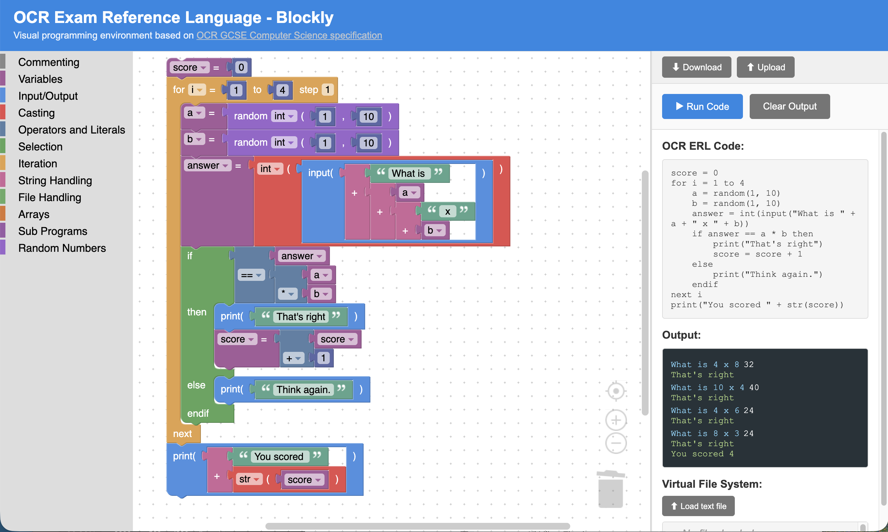

# OCR Exam Reference Language - Blockly Editor

A visual programming environment for OCR GCSE Computer Science's Exam Reference Language (ERL), built with [Blockly](https://developers.google.com/blockly).

Students drag and drop blocks to build programs that mirror OCR ERL syntax. The editor generates live pseudocode, executes programs in the browser, and requires no installation -- just open `index.html`.

## Getting Started

Open `index.html` in any modern web browser. No server or build step required. Blockly is loaded from a CDN, so an internet connection is needed on first load.

## Features

### Block Categories

The toolbox is organised to match the sections of the OCR specification:

- **Commenting** -- `// comment`
- **Variables** -- assignment (`x = 5`), constants (`const PI = 3.14`), globals
- **Input/Output** -- `input("prompt")` and `print(value)`, with literal and expression variants
- **Casting** -- `int()`, `str()`, `float()`, `real()`, `bool()`
- **Operators and Literals** -- arithmetic (`+`, `-`, `*`, `/`, `^`), comparison (`==`, `!=`, `<`, `<=`, `>`, `>=`), logic (`AND`, `OR`, `NOT`), numbers, strings, booleans, `MOD`, `DIV`
- **Selection** -- `if...then...endif`, `if...then...else...endif`, `if...then...elseif...then...else...endif`, `switch...case...endswitch`
- **Iteration** -- `for...next` (with and without step), `while...endwhile`, `do...until`
- **String Handling** -- `.length`, `.substring()`, `.left()`, `.right()`, `.upper`, `.lower`, `ASC()`, `CHR()`, string concatenation (`+`)
- **File Handling** -- `newFile()`, `open()`, `.close()`, `.readLine()`, `.writeLine()`, `.endOfFile()`
- **Arrays** -- 1D and 2D array creation, access and assignment, creation with values
- **Sub Programs** -- `procedure...endprocedure`, `function...return...endfunction`, with literal and variable parameter variants
- **Random Numbers** -- `random(min, max)` for both integers and reals

### Live ERL Code Display

The right-hand panel shows the OCR ERL pseudocode as you build your program. This updates automatically whenever blocks change.

### Program Execution

Click **Run Code** to execute your program. Output appears in the terminal-style panel. User input is handled inline in the output window -- type a response and press Enter.

### Save and Load Programs

- **Download** -- saves your program as a `.json` file
- **Upload** -- loads a previously saved `.json` program file

### Virtual File System

Programs that use file handling blocks operate on an in-memory virtual file system (VFS). The VFS panel below the output window lets you:

- **Load text files** -- upload `.txt`, `.csv`, or `.dat` files for your program to read
- **Download files** -- save files your program has written
- **Remove files** -- clear files from the VFS

Files in the VFS persist across multiple runs.

## Usage Tips

- Most block types come in two variants: a **literal** version (type directly into the block) and an **expression** version (plug in other blocks). Use whichever suits the task.
- For procedures and functions, type parameter names separated by commas in the literal version, or use the variable-parameter version for a single parameter picked from the variable dropdown.
- The `for` loop comes in two forms: a simple version (step of 1) and a version with a configurable step value.
- The `random` block has a dropdown to choose between integer and real output.
- Arrays are 0-indexed. `array colours[5]` creates 5 elements with indices 0 to 4.

## Acknowledgements

This tool is based on the OCR GCSE Computer Science (J277) specification. The Exam Reference Language is defined in the [OCR specification document](https://www.ocr.org.uk/Images/558027-specification-gcse-computer-science-j277.pdf).

Built with [Google Blockly](https://developers.google.com/blockly).

## Contributing

This project is a single HTML file (`index.html`) containing all CSS, HTML, and JavaScript. Contributions and improvements are welcome.

## Licence

This project is licensed under the [MIT License](LICENSE).
